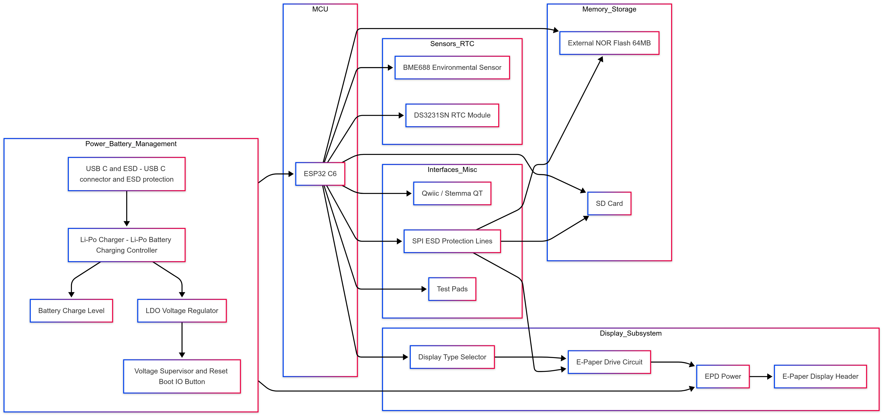

# eBookReader

## Diagrama Bloc

## Bill Of Materials (BOM)

| Reference | Description               | Qty | Supplier    | Mouser Link                                                             | Comet Link                                                              | Datasheet                                                                                                  |
|-----------|---------------------------|-----|-------------|-------------------------------------------------------------------------|-------------------------------------------------------------------------|-----------------------------------------------------------------------------------------------------------|
| U1        | ESP32-C6 Module           | 1   | Adafruit    | [Mouser](https://www.mouser.com/ProductDetail/Adafruit/ESP32-C6)            | [Comet](https://comet.com/Adafruit/ESP32-C6)                              | [Datasheet](https://www.adafruit.com/product/ESP32-C6-datasheet)                                           |
| R1        | 10kΩ Resistor             | 5   | Vishay      | [Mouser](https://www.mouser.com/ProductDetail/Vishay/10k-Resistor)          | [Comet](https://comet.com/Vishay/10k-Resistor)                            | [Datasheet](https://www.vishay.com/docs/10k-Resistor-datasheet.pdf)                                         |
| C1        | 100nF Capacitor           | 3   | Murata      | [Mouser](https://www.mouser.com/ProductDetail/Murata/100nF-Capacitor)        | [Comet](https://comet.com/Murata/100nF-Capacitor)                         | [Datasheet](https://www.murata.com/en-us/products/capacitors/100nF-datasheet.pdf)                         |
| J1        | JST SH 4-pin Connector    | 1   | Adafruit    | [Mouser](https://www.mouser.com/ProductDetail/Adafruit/4208)                | [Comet](https://comet.com/Adafruit/4208)                                  | [Datasheet](https://www.armega.com.tr/datasheet/4208-adafruit-industries-llc-datasheet-7323652)             |

